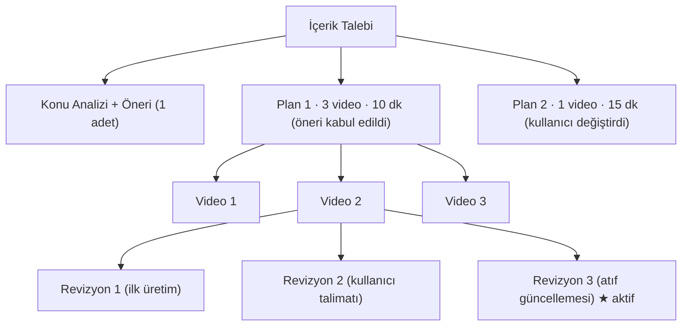
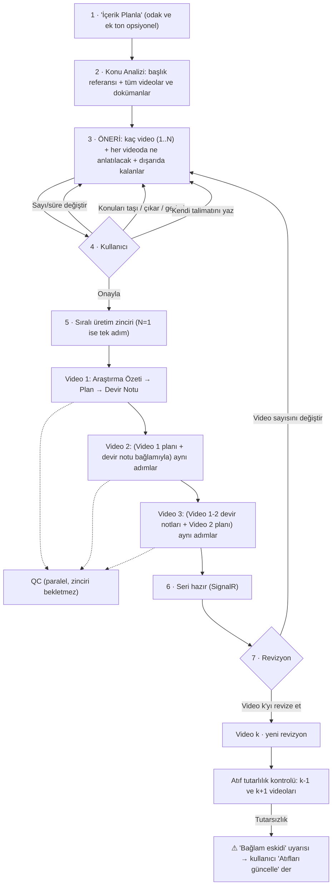
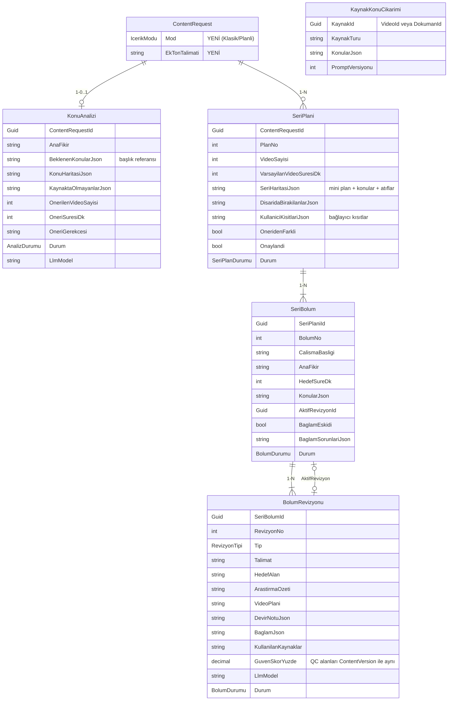
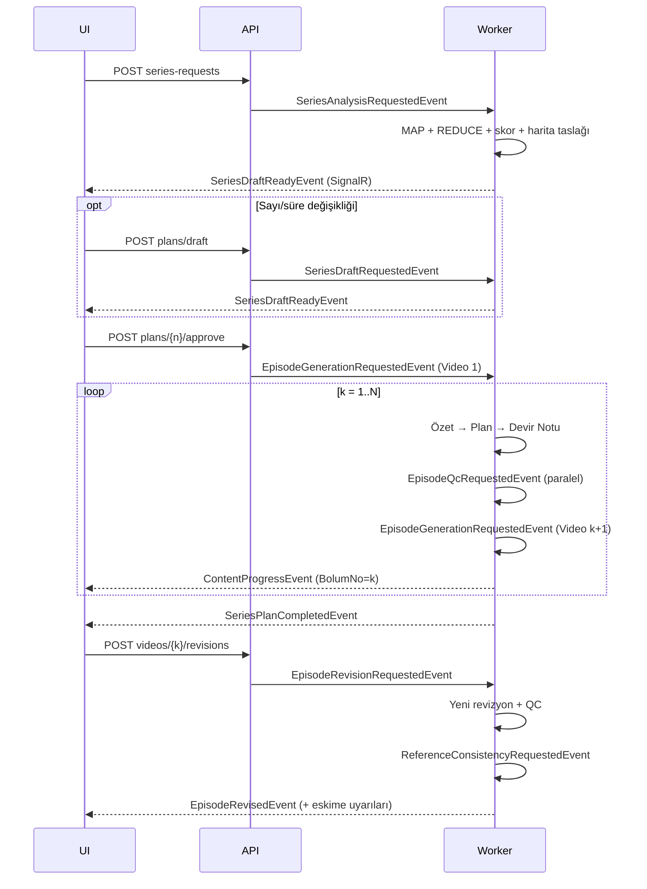

# Geliştirme Planı — Akıllı İçerik Planlayıcı (v3)

> **Proje:** VideoOzet · **Özellik:** İçerik Planlayıcı (tek ya da çok video) · **Durum:** Onay bekliyor
> **v2'den farkı:** "Tek Video / Seri" diye iki ayrı mod **yok**. Her talepte yapay zeka içeriği analiz eder, **kaç video gerektiğini (1 dahil)** ve **her videoda neyin anlatılacağını** önerir. Öneri, eğitimin başlığına göre yapılır. Kullanıcının kararı her zaman öneriden üstündür (§1, §4.1, §6).

---

## 1. Kararlar ve Tasarıma Etkileri

| Konu | Kararınız | Tasarıma etkisi |
|---|---|---|
| 🆕 Mod | **İki ayrı mod olmayacak.** Tek mi çok mu olacağını yapay zeka önerecek. | Talep formunda mod seçici yok. Tek bir **"İçerik Planla"** butonu var. 1 videoluk öneri de N videoluk öneri de aynı sistemle üretilir. 1 video = atıfsız, köprüsüz bir plan. |
| 🆕 Önerinin içeriği | Öneri yalnızca sayı değil, **her videoda nelerin anlatılacağını** da içermeli. Tek video önerisinde de. | Her video kartında konu listesi ve her konu için "bu videoda ne anlatılacak" satırı bulunur. Dışarıda bırakılan konular gerekçesiyle listelenir (§6.1). |
| 🆕 Başlık referansı | Öneri, **dersin başlığına** bakılarak yapılmalı: bu konu için neler anlatılmalı? | `Egitim.Ad` + `Egitim.Aciklama` (+ talepteki odak) analizin çapasıdır. Konulara **Başlık Uyumu** puanı verilir. Başlıkla ilgisiz konular dışarıda bırakılır. Başlıkta beklenip kaynaklarda bulunmayan konular uyarı olarak gösterilir (§5.0). |
| 🆕 Kullanıcı kararı | Öneri bir taslaktır. Kullanıcı farklı karar verirse **onun dediği yapılır.** | Sayı, süre, konu atamaları ve serbest talimat **bağlayıcı kısıt** olarak saklanır (`KullaniciKisitlariJson`). Yapay zeka bu kısıtları değiştiremez, yalnızca etrafını doldurur (§6.3). |
| Revizyon yapısı | **Her videonun kendi revizyonları** olacak | Revizyon sayacı video bazında tutulur. Video sayısı değişirse yeni bir **Plan** açılır (§3). |
| Video süresi | **Değiştirilebilir** olacak | Talep formunda sorulmaz. Varsayılan süre (config, 10 dk) ile öneri yapılır. Öneri ekranında genel süre ve video bazında süre değiştirilebilir. Süre değişince önerilen sayı yeniden hesaplanır. |
| Analiz kapsamı | **Hepsi taransın** | Eğitimdeki tüm videolar ve dokümanlar Map-Reduce ile taranır (§5). |
| Videolar arası bağ | **Bağımsız olmasın.** 2. video yazılırken 1. videoya bakılsın, birbirine atıf yapsınlar. Önden bir mini plan olsun. | **Seri Haritası** (mini plan + atıf haritası) öneri ekranında gösterilir (§6). Üretim **sıralı zincir** hâlinde yapılır. Her video bir sonrakine **Devir Notu** bırakır (§7). Revizyonda **atıf tutarlılığı** kontrol edilir (§8). |
| Ton | Genel ton sabit. Prompt'a ekstra ton yazılırsa ona uyulsun. | Sabit **Ton Rehberi** + talep başına isteğe bağlı **Ek Ton Talimatı** (§9). |
| Araştırma özeti | **Video başına** olacak | Her video revizyonunda kendi Araştırma Özeti + Video Planı + QC raporu bulunur. |

---

## 2. Bu Turda Yapılan Düzeltme ✅

**Model etiketi:** Kayıtlara `"Claude-3.5-Sonnet"` / `"gemini-1.5-flash"` yazılıyordu. Artık **fiilen kullanılan model adı** yazılıyor. Şu anki `.env` ile bu değer `gemini-3.8-flash-tiered`.

| Dosya | Değişiklik |
|---|---|
| [ISynthesisProvider.cs](file:///d:/Hoca/VideoOzet/src/VideoOzet.Business/Interfaces/ISynthesisProvider.cs) / [IGeminiProvider.cs](file:///d:/Hoca/VideoOzet/src/VideoOzet.Business/Interfaces/IGeminiProvider.cs) | `ActiveModelName` özelliği eklendi. Varsayılan gövdesi olduğu için mevcut mock'lar bozulmaz. |
| [ClaudeSynthesisProvider.cs](file:///d:/Hoca/VideoOzet/src/VideoOzet.Business/Infrastructure/AI/ClaudeSynthesisProvider.cs) | Modeli, `CallLlmAsync` ile aynı sırayla (Anthropic → Gemini → OpenAI) belirliyor |
| [GeminiSummarizer.cs](file:///d:/Hoca/VideoOzet/src/VideoOzet.Business/Infrastructure/AI/GeminiSummarizer.cs) | İstekte gönderilen model ile kayda yazılan model aynı sabitten geliyor. İstek davranışı değişmedi. |
| [GenerateContentConsumer.cs](file:///d:/Hoca/VideoOzet/src/VideoOzet.Worker/Consumers/GenerateContentConsumer.cs), [ContentRequestsController.cs](file:///d:/Hoca/VideoOzet/src/VideoOzet.API/Controllers/ContentRequestsController.cs), [SummarizeVideoConsumer.cs](file:///d:/Hoca/VideoOzet/src/VideoOzet.Worker/Consumers/SummarizeVideoConsumer.cs) | Sabit etiket yerine `ActiveModelName` kullanılıyor |
| [content-result.component.ts](file:///d:/Hoca/VideoOzet/src/VideoOzet.UI/src/app/features/content-result/content-result.component.ts) | İndirilen dokümanda model bilgisi yoksa artık "Claude" uydurulmuyor, "Bilinmiyor" yazılıyor |

> [!NOTE]
> Veritabanındaki **eski kayıtlar** hâlâ eski etiketi taşıyor. İsterseniz tek seferlik bir SQL ile düzeltilebilir. Kodda sadece yeni kayıtlar etkilendi.

### Hâlâ açık olan ön koşullar (Faz 0'da yapılacak)

| # | Sorun | Neden önemli |
|---|---|---|
| P1 ✅ | `OzetMetni` alanına LLM'in ham JSON yanıtı yazılıyordu. `KonuBasliklari` hep `"[]"` idi. **Düzeltildi:** [SummarizeVideoConsumer.cs](file:///d:/Hoca/VideoOzet/src/VideoOzet.Worker/Consumers/SummarizeVideoConsumer.cs) artık JSON'ı [LlmJson](file:///d:/Hoca/VideoOzet/src/VideoOzet.Business/Helpers/LlmJson.cs) ile ayrıştırıyor. | Konu analizi temiz özete ve başlıklara dayanacak |
| P2 ✅ | Gemini hatası exception yerine `"[GEMINI_API_ERROR]..."` metni olarak dönüyordu. **Düzeltildi:** [ClaudeSynthesisProvider.cs](file:///d:/Hoca/VideoOzet/src/VideoOzet.Business/Infrastructure/AI/ClaudeSynthesisProvider.cs) artık exception fırlatıyor. | Hata metni video planı gibi kaydedilir. Zincirde sonraki videolara da bağlam olarak geçer. |
| P3 | Revizyon senkron HTTP içinde yapılıyor ([ContentRequestsController.cs:206-320](file:///d:/Hoca/VideoOzet/src/VideoOzet.API/Controllers/ContentRequestsController.cs#L206-L320)) | Seride tüm uzun işlemler kuyruk + SignalR ile yapılmalı |
| P5 | RAG yalnızca en yakın 15 chunk'ı getiriyor | "Tümünü tara" kararı için Map-Reduce gerekiyor |

---

## 3. Kavramlar ve Adresleme



| Kavram | Anlamı | Ne zaman yenisi oluşur? |
|---|---|---|
| **Konu Analizi** | Eğitimin konu haritası, önem puanları, önerilen video sayısı | Talep oluşturulunca (gerekirse yeniden çalıştırılabilir) |
| **Seri Planı** | Video sayısı + süreler + **Seri Haritası** (mini plan + atıflar) | Video sayısı ya da dağılım değişince. Onaylanmış plan değiştirilemez, değişiklik yeni plan açar. |
| **Video (Bölüm)** | Planın bir videosu. Başlığı, ana fikri ve konuları vardır. | Plan onaylanınca |
| **Revizyon** | Videonun o andaki tam içeriği: Araştırma Özeti + Video Planı + Devir Notu + QC | İlk üretimde, her kullanıcı revizyonunda, her atıf güncellemesinde |
| **Aktif Revizyon** | Videonun "geçerli" sayılan revizyonu. Diğer videolar buna atıf yapar. | Varsayılan olarak en son revizyon. Kullanıcı eski bir revizyonu aktif yapabilir. |

**Adres formatı:** `Plan 1 › Video 2 › Revizyon 3`

> [!IMPORTANT]
> **Neden ayrıca "Seri Planı" katmanı var?** 3 videoluk bir seriden 5 videoya geçildiğinde "Video 2"nin içeriği tamamen değişir. O noktada Video 2'nin "Revizyon 4"ü olmaz, ortada artık başka bir video vardır. Bu yüzden sayı değişikliği yeni bir plan açar. Eski plan ve tüm revizyonları silinmez, görüntülenebilir kalır.

---

## 4. Genel Akış



### 4.1 Kullanıcı senaryoları 🆕

| # | Kullanıcı ne yapar? | Sistem ne yapar? |
|---|---|---|
| S1 | Videoları yükler, **"İçerik Planla"** butonuna basar | Analiz başlar. Bittiğinde öneri ekranı açılır: *"Bu içerik 3 videoda anlatılmalı. Video 1: …, Video 2: …, Video 3: …"*. Her videonun altında anlatılacak konular yazar. |
| S2 | İçerik az, tek video yeterli | Öneri doğrudan *"1 video"* olur. Kartta yine hangi konuların anlatılacağı ve hangilerinin dışarıda kaldığı yazar. |
| S3 | Öneriyi beğenmez, sayıyı **1** yapar | Öneri geçersiz olur. Tüm çekirdek konular tek videoya sığdırılır, sığmayanlar gerekçesiyle dışarıda bırakılır. Yeni öneri ekranda görünür. |
| S4 | Sayıyı **5** yapar | Konular 5 videoya yeniden dağıtılır. Atıf haritası yeniden kurulur. |
| S5 | Konuları kendisi düzenler: bir konuyu çıkarır, dışarıdakini ekler, konuyu Video 2'den Video 3'e taşır | Atamalar **kilitlenir**. Yapay zeka yalnızca başlık, ana fikir, kanca ve atıfları yeni atamaya göre yeniden yazar. Atamalara dokunmaz. |
| S6 | Kendi talimatını yazar: *"Tek video yap, sadece X ve Y'yi anlat, Z'ye hiç girme"* | Talimat bağlayıcı kısıt olarak kaydedilir. Öneri bu talimata göre yeniden üretilir. Talimat ile önceki öneri çelişirse **talimat kazanır**. |
| S7 | **"Onayla ve Videoları Yaz"** der | Plan kilitlenir. Videolar sırayla yazılır (N=1 ise tek video yazılır). |
| S8 | 3 video yazıldı. Yalnızca **Video 2**'yi revize eder | Yalnızca Video 2'de yeni revizyon oluşur. Video 1 ve 3 değişmez. Video 2 yazılırken Video 1 ve 3 bağlam olarak okunur. Video 3'ün açılışı artık tutmuyorsa ⚠ uyarı çıkar, düzeltme kullanıcının onayıyla yapılır. |

> [!IMPORTANT]
> **Öneri yalnızca başlangıç noktasıdır.** Kullanıcı herhangi bir şeyi değiştirdiği anda değişen kısım kilitlenir. Sonraki tüm üretimler bu kilitlere uymak zorundadır. Sistem "öneriye geri dönmek" için kullanıcının açıkça **[Öneriye sıfırla]** demesini bekler.

---

## 5. Konu Analizi (Map-Reduce)

Kapsam: **tüm videolar + tüm dokümanlar**, referans: **eğitimin başlığı**.

### 5.0 Başlık referansı 🆕
Analiz, "yüklenenlerde ne var?" sorusundan önce "**bu başlık için ne anlatılmalı?**" sorusunu sorar.

- **Girdi:** `Egitim.Ad` + `Egitim.Aciklama` + (varsa) talepteki odak metni.
- **Çıktı (küçük LLM çağrısı, önbellekli):** *Beklenen Konular* listesi. Bu başlıkta bir izleyicinin anlaması gereken ana noktalar (genelde 5-12 madde).
- REDUCE adımında kaynaklardan çıkan her konu bu listeyle eşleştirilir:

| Durum | Sonuç |
|---|---|
| Kaynakta var, başlıkta bekleniyor | Güçlü aday. Başlık Uyumu (**B**) yüksek. |
| Kaynakta var, başlıkla ilgisi zayıf | B düşük. B ≤ 3 ise **KONU DIŞI** olarak dışarıda bırakılır (gerekçe: "başlıkla ilgisiz"). |
| Başlıkta bekleniyor, kaynakta **yok** | Videoya **girmez** (kaynak sadakati kuralı). Öneri ekranında ℹ️ *"Kaynaklarda bulunmayan beklenen konular"* uyarısı olarak gösterilir. Kullanıcı isterse ilgili videoyu/dokümanı ekleyip analizi yeniler. |

### 5.1 MAP — Kaynak başına konu çıkarımı (önbellekli)
- **Kaynaklar:** Her video için temiz `OzetMetni` + `KonuBasliklari` (P1 sonrası). Her doküman için `DokumanMetin.HamMetin`.
- Uzun metin (yaklaşık 25.000 kelimeden fazla) parçalanır, parça başına map'lenir.
- Sonuç `KaynakKonuCikarimi` tablosunda önbelleğe alınır. Yeni video ya da doküman eklenince yalnızca o kaynak map'lenir. Prompt değişirse `PromptVersiyonu` artırılır ve önbellek geçersiz olur.

### 5.2 REDUCE — Birleştirme, ön koşullar, puanlama
Tek bir LLM çağrısı şunları üretir: birleşik konu listesi (`kaynakIds` korunur), her konunun tahmini anlatım süresi, ön koşul ilişkileri, Beklenen Konular eşleşmesi ve eğitimin **tek cümlelik ana fikri**. Her konuya dört ayrı puan verilir:

| Puan | Anlamı |
|---|---|
| **A** — Ana Fikir Katkısı (1-10) | Bu konu olmadan ana mesaj anlaşılır mı? |
| **B** — Başlık Uyumu (1-10) 🆕 | Bu konu eğitimin başlığının vaat ettiği şeye ne kadar hizmet ediyor? |
| **I** — İlgi Potansiyeli (1-10) | Genç izleyicide merak uyandırma, şaşırtma, günlük hayatla bağ kurma gücü |
| **Y** — Anlatım Yükü (1-10) | Ne kadar teknik detay ve ön bilgi gerektirdiği (yüksek = ağır) |

### 5.3 Önem ve kategori (kodda hesaplanır)
```
Önem = 0.40·A + 0.15·B + 0.30·I + 0.15·(11 − Y)
KONU DIŞI     : B ≤ 3               → dışarıda (gerekçe: başlıkla ilgisiz)
ÇEKİRDEK      : A ≥ 8 ve B ≥ 6      → her durumda bir videoya girer
DESTEKLEYİCİ  : Önem ≥ 6            → süre izin verirse
ATLANABİLİR   : diğerleri           → gerekçesiyle dışarıda bırakılır
```
Ağırlıklar ve eşikler `appsettings.json → SeriesPlanning` altında tutulur.

### 5.4 Video sayısı önerisi (1 dahil)
```
T          = video süresi (dk)                  ← varsayılan 10 (config); öneri ekranında değiştirilebilir
ek_yük     = 1.0 dk (tek video) | 1.5 dk (çok video: + önceki videoya atıf ve köprü)
toplam     = Σ süre(ÇEKİRDEK) + Σ süre(DESTEKLEYİCİ)
n_süre     = ceil(toplam / (T − ek_yük))
n_bilişsel = ceil(|ÇEKİRDEK| / 3)
öneri      = clamp(max(n_süre, n_bilişsel), 1, 8)
```
- İçerik azsa sonuç doğal olarak **1** çıkar. Tek video için ayrı bir kural yoktur.
- `n_süre` sınırda ise (ör. 1.1) ve DESTEKLEYİCİ konular çıkarılınca 1 videoya sığıyorsa öneri **1 video** olur. Çıkarılan konular "süre nedeniyle dışarıda" olarak listelenir. Gerekçe metninde alternatif de yazılır: *"İstersen 2 videoda bu konular da girer."*
- Süre değiştirilirse öneri **anında** yeniden hesaplanır. Bu işlem LLM gerektirmez.

### 5.5 Öneri gerekçesi
Kullanıcıya gösterilen kısa metin, kodla hesaplanan sayılardan üretilir: *"Başlıkla ilgili 6 çekirdek konu var, anlatımı ~24 dk. 10 dakikalık videolarla en iyi 3 videoda anlatılır. 2 konu başlıkla ilgisiz olduğu için dışarıda."*

---

## 6. Öneri Haritası (Mini Plan + Atıf Haritası)

Analiz biter bitmez, önerilen sayıyla bir **taslak Plan** oluşturulur. Kullanıcı öneriyi bu haritayla birlikte görür. Videolar daha yazılmadan **her videonun neyi anlatacağı** ve (çok videoda) videoların **birbirine nerede atıf yapacağı** belli olur.

> [!NOTE]
> **Tek video da aynı yapıdadır.** N=1 olduğunda harita tek karttan oluşur: başlık, ana fikir, kanca, anlatılacak konular ve dışarıda kalanlar. Atıf, açılış ve kapanış köprüsü alanları boş kalır, ilgili doğrulamalar atlanır.

### 6.1 İçerik (her video için)

| Alan | Örnek |
|---|---|
| `calismaBasligi` | "Düşünmenin de kuralları var" |
| `anaFikir` (tek cümle) | "Doğru düşünmek doğuştan değil, öğrenilen bir beceri." |
| `hedefSureDk` | 10 (video bazında değiştirilebilir) |
| `konular[]` 🆕 | `{ konuId, baslik, neAnlatilacak, tahminiSureDk, kategori }` · ör. *"Önermeler — Bir cümlenin doğru/yanlış olabilmesi; günlük konuşmadan 2 örnek"* |
| `kanca` | "Hiç haklı olduğun hâlde tartışmayı kaybettin mi?" |
| `acilis` | (Video 2+) Önceki videodan nasıl devralınacağı |
| `kapanisKoprusu` | Sonraki videoya bırakılan soru ya da merak |
| `atiflar[]` | Aşağıdaki tablo |

**Atıf türleri:**

| Tür | Anlamı | Örnek |
|---|---|---|
| ↪ **Vaat** (ileri atıf) | "Bunu ileride göreceğiz" | V1 → V3: "Safsataları üçüncü videoda tek tek söküp atacağız" |
| ↩ **Geri atıf** | "Hatırlarsan..." | V3 → V1: "İlk videodaki tartışma örneğine dönelim" |
| 🔗 **Köprü** | Bir videonun kapanışı sonrakinin açılışı olur | V1 kapanışı = V2 açılışı: "Peki kurallar bilerek çiğnenirse?" |
| 🔁 **Örnek sürekliliği** | Aynı örnek ya da karakter seri boyunca gelişir | "Ali'nin tartışması" V1'de başlar, V3'te çözülür |

Harita seviyesinde ayrıca: `disaridaBirakilanlar[]` (konu + neden: *başlıkla ilgisiz / süre / tekrar / ağır detay*) ve `kaynaktaOlmayanBeklenenler[]` (§5.0).

### 6.2 Doğrulama (kod)
- **Kullanıcı kısıtları önce gelir:** Kilitli atamalar, sayı ve süre birebir korunmalı. Serbest talimatta "anlatma" denen konu hiçbir videoda olmamalı.
- Her ÇEKİRDEK konu tam olarak bir videoda olmalı (kullanıcı çıkardıysa hariç). Ön koşul sırası korunmalı.
- Video süreleri kendi `hedefSureDk` değerlerinin `[0.6×, 1.3×]` aralığında olmalı.
- **Her vaadin karşılığı olmalı:** V_i'den V_j'ye bir vaat varsa, V_j'de V_i'ye bir geri atıf bulunmalı.
- **Köprü zinciri kopmamalı:** Son video hariç her videonun `kapanisKoprusu` dolu olmalı ve sonraki videonun `acilis` alanında karşılığı bulunmalı.
- Doğrulama başarısız olursa hatalar LLM'e geri bildirilir ve **1 kez** yeniden denenir.

### 6.3 Kullanıcı etkileşimi ve kısıtlar 🆕

Kullanıcının yaptığı her değişiklik `SeriPlani.KullaniciKisitlariJson` alanına yazılır ve sonraki tüm harita üretimlerinde **zorunlu** olarak prompt'a ve doğrulamaya girer.

| Etkileşim | Kısıt kaydı | Ne yeniden üretilir? |
|---|---|---|
| Video sayısını değiştir (1..8) | `videoSayisi` | Konu dağılımı + başlık/kanca/atıflar. Konu analizi tekrarlanmaz. |
| Genel ya da video bazında süre değiştir | `varsayilanSureDk`, `videoSureleri{}` | Önerilen sayı anında güncellenir (sayı kullanıcı tarafından kilitlenmediyse). Harita yeniden dağıtılır. |
| Konuyu çıkar / dışarıdakini ekle | `haricKonular[]`, `zorunluKonular[]` | Harita, bu listelere uyacak şekilde yeniden dağıtılır |
| Konuyu başka videoya taşı | `kilitliAtamalar{konuId: videoNo}` | Atamalar korunur. Yalnızca başlık, ana fikir, kanca ve atıflar yeniden yazılır. |
| Başlık / ana fikir / kanca metnini düzenle | `kilitliMetinler{}` | Hiçbir şey. Diğer videoların atıfları gerekiyorsa güncellenir. |
| Serbest talimat yaz | `talimat` | Tüm harita bu talimata göre yeniden üretilir. Talimat, önceki kısıtlarla çelişirse **talimat kazanır** ve çelişen kısıtlar kaldırılır (kullanıcıya gösterilerek). |
| **[Öneriye sıfırla]** | Tüm kısıtlar silinir | Yapay zekanın ilk önerisi geri gelir |
| **[Onayla ve Videoları Yaz]** | Plan kilitlenir | Üretim zinciri başlar |

- Onaylanmamış taslak her değişiklikte **üzerine yazılır** (yeni plan numarası açılmaz). Plan numarası yalnızca onaylı bir plandan sonra sayı değişirse artar.
- Konu analizi ancak yeni video/doküman eklenince ya da kullanıcı **[Analizi yenile]** derse tekrar çalışır.

---

## 7. Sıralı Üretim Zinciri ve Devir Notu 🆕

### 7.1 Neden sıralı?
"2. video yazılırken 1. videonun nasıl bittiğini bilsin" istediniz. Bunun için **Video k, Video k−1'in gerçek çıktısını görmeli**. Bu yüzden videolar paralel değil, **sırayla** üretilir. QC zinciri bekletmez, paralel çalışır.

> [!WARNING]
> **Bedeli:** Toplam süre video sayısıyla doğrusal artar. Video başına 3 LLM çağrısı yapılır (özet, plan, devir notu). 5 videoluk bir seri birkaç dakika sürebilir. UI'da canlı ilerleme gösterilir: *"Video 2/5 yazılıyor — Video 1'in devir notu kullanılıyor"*.

### 7.2 Video k için adımlar
1. **RAG:** Videoya atanmış her konu için `baslik + ozet` embed edilir. Arama `EgitimId` ve `kaynakIds` ile filtrelenir. Konu başına top-5, bölüm başına en fazla ~20 chunk alınır.
2. **Araştırma Özeti** (video başına): Bu videonun konularına odaklı, kaynağa sadık özet.
3. **Video Planı:** Araştırma özeti + bağlam paketi (§7.3) ile yazılır.
4. **Devir Notu:** Planın kısa ve yapılandırılmış özeti. Bir sonraki videoya aktarılır.
5. `EpisodeQcRequested` olayı yayınlanır (paralel). Sonra `k < N` ise Video k+1 tetiklenir.

### 7.3 Bağlam paketi (token bütçesine göre katmanlı)

| Katman | İçerik | Neden |
|---|---|---|
| Seri Haritası | Tüm videoların başlık, ana fikir, konu ve atıf bilgileri | Büyük resim, ileri vaatler |
| Video 1..k−1 **Devir Notları** | Kısa JSON'lar | Nelerin anlatıldığını bilmek, tekrar etmemek, geri atıf yapmak |
| Video k−1 **tam planı** (aktif revizyon) | Markdown | "Nasıl bitti?" sorusunun tam cevabı, doğal geçiş |
| Video k'ya ait atıf listesi | Seri haritasından | Atıfların plana **zorunlu** olarak girmesi |
| Video k+1 haritası | Başlık + açılış | Kapanış köprüsünü doğru kurmak |
| RAG kaynakları | ~20 chunk | Bilgi doğruluğu |
| Ton Rehberi + Ek Ton Talimatı | Sabit + kullanıcı metni | Ortak ses |

### 7.4 Devir Notu şeması
```json
{
  "kapsananlar": ["Önermeler", "Doğruluk değeri"],
  "nasilBitti": "Ali'nin tartışmasını yarım bıraktık; izleyiciye 'sence hata neredeydi?' diye sorduk.",
  "birakilanSoru": "Peki kurallar bilerek çiğnenirse?",
  "vaatler": [{ "hedefVideo": 3, "konu": "Safsatalar" }],
  "tanitilanTerimler": [{ "terim": "önerme", "tanim": "doğru ya da yanlış olabilen cümle" }],
  "kullanilanOrnekler": ["Ali'nin tartışması", "Hava durumu örneği"]
}
```

---

## 8. Video Bazlı Revizyon ve Atıf Tutarlılığı 🆕

### 8.1 Revizyon türleri

| Tür | Tetikleyen | Ne yapar? |
|---|---|---|
| `IlkUretim` | Plan onayı | Zincirdeki ilk üretim |
| `KullaniciRevizyonu` | Kullanıcı talimatı + hedef (özet / plan / hepsi) | Yalnızca o videoyu revize eder. **Diğer videoların aktif revizyonlarını bağlam olarak kullanır.** Yeni devir notu üretir. |
| `AtifGuncelleme` | Kullanıcı ("Atıfları güncelle") | İçeriğe dokunmaz. Yalnızca diğer videolara yapılan atıf cümlelerini, açılışı ve kapanışı günceller. |
| `YenidenUretim` | Kullanıcı ya da hata sonrası retry | Videoyu güncel bağlamla sıfırdan üretir |

Her revizyonda `BaglamJson` saklanır: `{ "1": "<Video1 revizyonId>", "3": "<Video3 revizyonId>" }`. Böylece "bu revizyon hangi revizyonlara bakılarak yazıldı" sorusu her zaman cevaplanabilir.

### 8.2 Atıf tutarlılık kontrolü
Video k'nın aktif revizyonu değişince, yani revizyon yapılınca ya da eski bir revizyon aktif edilince:

1. Video k'ya **atıf yapan** videolar belirlenir: k+1 (köprü) ve haritada k'ya atıf yapan tüm videolar.
2. Her biri için küçük bir LLM çağrısı yapılır: *"Video j'nin açılışı ve atıfları, Video k'nın yeni devir notuyla tutarlı mı?"* Çıktı: `{ "tutarli": false, "sorunlar": ["V2 açılışı, V1'in artık sormadığı bir soruya cevap veriyor"] }`
3. Tutarsızsa Video j **⚠ "Bağlam eskidi"** olarak işaretlenir. UI uyarı gösterir. Otomatik düzeltme **yapılmaz**, kontrol kullanıcıdadır: **[Atıfları güncelle]** ya da **[Yoksay]**.

> [!TIP]
> Bu kontrolü metin karşılaştırması (hash) yerine LLM ile yapıyoruz. Nedeni şu: model aynı anlamı her seferinde farklı cümlelerle yazar, hash her revizyonda değişir ve sürekli yanlış alarm üretir.

### 8.3 Kurallar
- Aynı video için aynı anda tek bir revizyon işlenebilir. İkinci istek `409 Conflict` döner.
- Revizyon hatası mevcut aktif revizyonu **bozmaz**. Yeni revizyon `Hata` durumunda kalır, retry edilebilir.

---

## 9. Ton

```text
TON REHBERİ (sabit — tüm videolarda ortak):
- Amaç bilgi yığmak değil; merak uyandırıp ana fikri akılda bırakmak.
- Kitle gençler: samimi, akıcı, "sen" dili; ciddiyet korunur — argo, abartılı espri, yanıltıcı clickbait yok.
- Her video TEK ana fikre hizmet eder; hizmet etmeyen bilgi çıkarılır.
- İlk 15 saniye: soru, paradoks ya da şaşırtıcı bir gözlem.
- Jargon minimum; zorunlu terim ilk geçtiği yerde tek cümleyle açıklanır.
- Soyut kavram mutlaka somut, güncel bir örnekle bağlanır.
- Seri bütünlüğü: önceki videolara doğal geri atıflar, sonraki videoya merak köprüsü.
- SADECE verilen kaynaklardaki bilgiler kullanılır.

EK TON TALİMATI (talebe özel, boş olabilir):
{EkTonTalimati}
Not: Ek talimat sabit rehberle çelişirse ek talimat önceliklidir; kaynak sadakati kuralı hariç.
```

---

## 10. Mimari Değişiklikler

### 10.1 Eklenecekler

| Katman | Öğe | Açıklama |
|---|---|---|
| **Data** | `KonuAnalizi`, `SeriPlani`, `SeriBolum`, `BolumRevizyonu`, `KaynakKonuCikarimi` entity'leri + configuration'lar | §11 |
| | Enum'lar: `IcerikModu` (`Klasik` = eski kayıtlar, `Planli` = yeni akış), `AnalizDurumu`, `SeriPlanDurumu`, `BolumDurumu`, `RevizyonTipi` | `IcerikModu` kullanıcıya gösterilmez; yalnızca eski kayıtları ayırt etmek içindir. |
| | EF Migration: `AddSeriesPlanning` | |
| **Business** | `ISeriesPlanningService` / `SeriesPlanningService` | Konu analizi, skor, sayı önerisi, harita doğrulama, bağlam paketi oluşturma |
| | `SeriesScoring` (saf, statik) | Önem formülü, kategori, sayı hesabı. Kolay unit test edilir. |
| | `SeriesMapValidator` (saf) | §6.2 kuralları |
| | `IQualityCheckService` / `QualityCheckService` | QC mantığı tek yere taşınır (şu an iki kopya var) |
| | `LlmJson` helper | ```json çitleri, parse, hata metni tespiti |
| | `SeriesPromptTemplates` | §14 |
| | DTO'lar + validator'lar | `CreateSeriesRequestDto`, `SeriesDraftDto`, `EpisodeRevisionDto` … |
| | Event'ler | §12 |
| **Worker** | `TopicAnalysisConsumer` | Map-Reduce + skor + ilk harita taslağı |
| | `SeriesDraftConsumer` | Farklı sayı/süre için harita yeniden üretimi |
| | `EpisodeGenerationConsumer` | Zincir adımı (özet → plan → devir notu → sonrakini tetikle) |
| | `EpisodeRevisionConsumer` | Kullanıcı revizyonu, atıf güncelleme, yeniden üretim |
| | `EpisodeQcConsumer` | Revizyon başına QC |
| | `ReferenceConsistencyConsumer` | §8.2 atıf tutarlılık kontrolü |
| **API** | `SeriesController` | §13 |
| **Config** | `SeriesPlanning` bölümü | Ağırlıklar, eşikler, ek_yük, max video, chunk limitleri |
| **UI** | `series-planner`, `series-map`, `episode-viewer`, `revision-compare`, `plan-viewer` bileşenleri | §15 |

### 10.2 Değişecekler

| Öğe | Değişiklik |
|---|---|
| [ContentRequest.cs](file:///d:/Hoca/VideoOzet/src/VideoOzet.Data/Entities/ContentRequest.cs) | `+ Mod`, `+ EkTonTalimati`, `+ KonuAnalizi`, `+ SeriPlanlari`. `Konu` alanı "odak (opsiyonel)" olarak kullanılır; boşsa `Egitim.Ad` esas alınır. Var olan kayıtlar `Mod = Klasik` olur. |
| [ISynthesisProvider.cs](file:///d:/Hoca/VideoOzet/src/VideoOzet.Business/Interfaces/ISynthesisProvider.cs) | `+ CompleteAsync(prompt, ct)` (generic çağrı). Arayüz her prompt için ayrı metotla şişmez. |
| [ClaudeSynthesisProvider.cs](file:///d:/Hoca/VideoOzet/src/VideoOzet.Business/Infrastructure/AI/ClaudeSynthesisProvider.cs) | P2: Gemini hataları exception fırlatır. Tek-video akışı da bundan faydalanır, çünkü zaten hata durumunu yakalıyor. |
| [SummarizeVideoConsumer.cs](file:///d:/Hoca/VideoOzet/src/VideoOzet.Worker/Consumers/SummarizeVideoConsumer.cs) | P1: JSON parse edilir. `OzetMetni` ve `KonuBasliklari` ayrı yazılır. |
| `ContentProgressEvent` | `+ PlanNo?`, `+ BolumNo?`, `+ RevizyonNo?` |
| [PipelineProgressConsumer.cs](file:///d:/Hoca/VideoOzet/src/VideoOzet.API/Consumers/PipelineProgressConsumer.cs) | Yeni seri olaylarını SignalR'a iletir |
| [QualityCheckConsumer.cs](file:///d:/Hoca/VideoOzet/src/VideoOzet.Worker/Consumers/QualityCheckConsumer.cs) + [ContentRequestsController.cs](file:///d:/Hoca/VideoOzet/src/VideoOzet.API/Controllers/ContentRequestsController.cs) | QC kodu `IQualityCheckService`'e taşınır. Davranış aynı kalır. |
| [Worker/Program.cs](file:///d:/Hoca/VideoOzet/src/VideoOzet.Worker/Program.cs) | Yeni consumer kayıtları |
| [VideolarController.ResetQueue](file:///d:/Hoca/VideoOzet/src/VideoOzet.API/Controllers/VideolarController.cs#L69-L77) | Yeni kuyruk adları listeye eklenir |
| [course-detail](file:///d:/Hoca/VideoOzet/src/VideoOzet.UI/src/app/features/course-detail/course-detail.component.ts) | Mevcut "içerik üret" formu yerine tek **"İçerik Planla"** butonu (odak + ek ton opsiyonel). Mod ve süre sorulmaz. Talep listesinde "N video" rozeti. |
| [content-result](file:///d:/Hoca/VideoOzet/src/VideoOzet.UI/src/app/features/content-result/content-result.component.ts) | Markdown/QC/indirme kısmı `plan-viewer` bileşenine ayrılır. **Eski (Klasik) kayıtları** açmak için aynı görünümle kalır. |
| [api.service.ts](file:///d:/Hoca/VideoOzet/src/VideoOzet.UI/src/app/core/services/api.service.ts), [signalr.service.ts](file:///d:/Hoca/VideoOzet/src/VideoOzet.UI/src/app/core/services/signalr.service.ts) | Seri uç noktaları ve olay dinleyicileri |

### 10.3 Çıkacaklar

| Öğe | Durum |
|---|---|
| Mevcut tek-video akışı (başlatma) | **UI'dan kalkıyor.** Yeni talepler hep yeni akıştan geçer; tek video ihtiyacı N=1 öneriyle karşılanır. |
| Mevcut tek-video akışı (kayıtlar) | **Kalıyor.** Eski talepler görüntülenebilir, revize edilebilir. Backend kodu silinmez; yeni akış stabil olunca kaldırılması ayrıca değerlendirilir. |
| Sabit model etiketleri | ✅ Bu turda kaldırıldı |
| QC kodunun iki kopyası | Tek servise birleşiyor |
| v1 planındaki "seri seviyesi snapshot revizyon" | Kararınızla iptal → video bazlı revizyon |
| v1 planındaki "paralel bölüm üretimi" | İptal → sıralı zincir (bağlam için) |
| v1 planındaki "video başına araştırma özeti yok" | İptal → her revizyonda var |

---

## 11. Veri Modeli



**Benzersiz indeksler:** `(ContentRequestId, PlanNo)`, `(SeriPlaniId, BolumNo)`, `(SeriBolumId, RevizyonNo)`, `(KaynakId, KaynakTuru)`.

---

## 12. Olay (Event) Akışı



**Yeni olaylar:** `SeriesAnalysisRequestedEvent`, `SeriesDraftRequestedEvent`, `SeriesDraftReadyEvent`, `EpisodeGenerationRequestedEvent`, `EpisodeQcRequestedEvent`, `EpisodeRevisionRequestedEvent`, `EpisodeRevisedEvent`, `ReferenceConsistencyRequestedEvent`, `SeriesPlanCompletedEvent`, `SeriesErrorEvent`.

**Zincir dayanıklılığı:** Video k hata verirse zincir orada durur. Video k `Hata` olur, k+1..N `Bekliyor` durumunda kalır. Kullanıcı **[Video k'yı yeniden dene]** derse zincir kaldığı yerden devam eder. Mesajlar idempotent tasarlanır: aynı (Plan, BolumNo) için `IlkUretim` revizyonu zaten varsa tekrar üretilmez.

---

## 13. API Uç Noktaları

| Metot | Yol | Açıklama |
|---|---|---|
| `POST` | `/api/egitimler/{egitimId}/content-plans` | `{ odak?, hedefKitle?, ekTonTalimati? }` → 202 (analiz başlar) |
| `GET` | `/api/content-plans/{id}` | Analiz + öneri + plan listesi |
| `POST` | `/api/content-plans/{id}/plans/draft` | `{ videoSayisi?, varsayilanSureDk?, videoSureleri?, haricKonular?, zorunluKonular?, kilitliAtamalar?, talimat? }` → taslağı kısıtlarla yeniden üret (202) |
| `PUT` | `/api/content-plans/{id}/plans/{planNo}` | Metin düzenleme (başlık, ana fikir, kanca) — LLM gerektirmez |
| `POST` | `/api/content-plans/{id}/plans/{planNo}/reset` | Kısıtları sil, öneriye dön |
| `POST` | `/api/content-plans/{id}/reanalyze` | Konu analizini yenile (yeni kaynak eklendiyse) |
| `POST` | `/api/series-requests/{id}/plans/{planNo}/approve` | Planı kilitle, zinciri başlat (202) |
| `GET` | `/api/series-requests/{id}/plans/{planNo}` | Videolar + aktif revizyon özetleri + eskime durumları |
| `GET` | `…/plans/{planNo}/videos/{bolumNo}` | Video + tüm revizyonları |
| `POST` | `…/videos/{bolumNo}/revisions` | `{ talimat, hedefAlan }` → 202 (409: işlemde) |
| `POST` | `…/videos/{bolumNo}/refresh-references` | Atıf güncelleme (202) |
| `PUT` | `…/videos/{bolumNo}/active-revision` | `{ revizyonNo }` → aktif yap + tutarlılık kontrolü |
| `POST` | `…/videos/{bolumNo}/retry` | Hatalı videoyu yeniden üret, zinciri sürdür |
| `POST` | `…/videos/{bolumNo}/revisions/{revNo}/re-qc` | QC'yi yeniden çalıştır (202) |
| `POST` | `…/videos/{bolumNo}/dismiss-stale` | "Bağlam eskidi" uyarısını yoksay |

İki revizyonun karşılaştırması (diff) **istemci tarafında** yapılır. Ayrı bir uç nokta gerekmez.

---

## 14. Prompt Taslakları (özet)

<details>
<summary><b>SeriesMapPrompt — Seri Haritası + Atıflar</b></summary>

```text
{TON_REHBERİ}
Eğitimin başlığı: "{egitimAd}" — açıklama: "{egitimAciklama}" — odak: "{odak}"
Eğitimin ana fikri: "{anaFikir}"
Video sayısı: {N} · Varsayılan süre: {T} dk
Konu haritası (kategori ve önem kodla hesaplandı): {konuHaritasi}

KULLANICI KISITLARI (BAĞLAYICI — asla değiştirme, öneriden önce gelir):
{kullaniciKisitlari}   ← kilitli atamalar, hariç/zorunlu konular, serbest talimat

GÖREV: Konuları {N} videoya dağıt. Her konu için "bu videoda ne anlatılacak" satırı yaz.
N=1 ise atıf/köprü alanlarını boş bırak, tek videoyu kendi içinde bütün kur.
N>1 ise izleyiciyi seriye bağlayan bir anlatı akışı ve videolar arası ATIF HARİTASI kur.
- Her ÇEKİRDEK konu tam olarak bir videoda; ön koşul sırasına uy.
- Her video TEK ana fikir. Son video hariç her video bir kapanış köprüsü bırakır;
  sonraki video o köprüyle açılır.
- Her "vaat" için hedef videoda karşılık gelen bir "geri atıf" olmalı.
- Seri boyunca gelişen 1 ortak örnek/karakter önermen teşvik edilir.
Saf JSON: { "videolar":[{ "no","calismaBasligi","anaFikir","hedefSureDk","konuIds",
  "kanca","acilis","kapanisKoprusu","atiflar":[{"tur","hedefVideo","konu","taslakCumle"}] }],
  "disaridaBirakilanlar":[{"konuId","neden"}], "ortakOrnek": "..." }
{DOĞRULAMA_GERİ_BİLDİRİMİ}
```
</details>

<details>
<summary><b>EpisodeResearchPrompt — Video başına araştırma özeti</b></summary>

```text
"{seriBasligi}" serisinin {k}/{N}. videosu için ("{calismaBasligi}") araştırma özeti yaz.
Bu videonun konuları: {konular}. SADECE aşağıdaki kaynakları kullan, kaynak referansı ver.
Önceki videolarda anlatılanları tekrar etme, gerekirse kısaca an: {devirNotlariKapsananlar}
KAYNAKLAR: {ragChunks}
Markdown yaz.
```
</details>

<details>
<summary><b>EpisodePlanPrompt — Video planı (zincir)</b></summary>

```text
{TON_REHBERİ}{EK_TON}
SERİ HARİTASI: {seriHaritasi}
ÖNCEKİ VİDEOLARIN DEVİR NOTLARI: {devirNotlari_1..k-1}
BİR ÖNCEKİ VİDEONUN TAM PLANI (nasıl bittiğini gör): {plan_k-1}
SONRAKİ VİDEO: {harita_k+1.baslik} — açılışı: {harita_k+1.acilis}
BU VİDEO: {k}/{N} "{calismaBasligi}" · ana fikir: {anaFikir} · süre: {sure} dk
ZORUNLU ATIFLAR (plana doğal cümlelerle girmeli): {atiflar_k}
ARAŞTIRMA ÖZETİ: {arastirmaOzeti_k}

Şablon: ## Başlık Önerileri / ## Kanca (ilk 15 sn) / ## Önceki Videodan Geçiş /
## Ana Fikir / ## Akış (zaman çizelgeli) / ## Örnekler ve Benzetmeler /
## Seri Atıfları (hangi dakikada, hangi videoya) / ## Kapanış ve Sonraki Videoya Köprü /
## Bilerek Dışarıda Bırakılanlar
```
</details>

<details>
<summary><b>HandoffNotePrompt — Devir notu</b> · <b>ReferenceCheckPrompt</b> · <b>ReferenceRefreshPrompt</b></summary>

- **HandoffNote:** Planı §7.4 şemasına göre JSON'a özetler.
- **ReferenceCheck:** `{ videoJ.acilis + atiflar, videoK.yeniDevirNotu }` → `{ tutarli, sorunlar[] }`
- **ReferenceRefresh:** Mevcut [RevisionPrompt](file:///d:/Hoca/VideoOzet/src/VideoOzet.Business/Helpers/PromptTemplates.cs#L72-L93) mantığıyla çalışır, ek olarak *"YALNIZCA diğer videolara yapılan atıfları, açılışı ve kapanış köprüsünü güncelle"* kısıtı eklenir.
</details>

---

## 15. UI Tasarımı

### 15.1 Talep (course-detail)
```
Eğitim: "Mantığa Giriş"
Odak (opsiyonel) ........................   ← boşsa eğitimin başlığı esas alınır
Ek ton talimatı (opsiyonel): "Biraz daha esprili, ama dini terimlerde ciddi kal"
                                              [ ✨ İçerik Planla ]
```
Mod, video sayısı ve süre burada **sorulmaz**. Hepsi öneri ekranında gelir.

### 15.2 Ekran A — Öneri (`series-planner` → `series-map`)

**Çok video önerisi:**
```
✨ Öneri: 3 video × 10 dk                      Video sayısı [ − 3 + ]   Süre [10 dk ▾]
Gerekçe: Başlıkla ilgili 6 çekirdek konu, ~24 dk anlatım. 2 konu başlıkla ilgisiz.
ℹ️ Kaynaklarda bulunmayan beklenen konu: "Tümevarım" (videoya girmeyecek)

┌ Video 1 ──────────────────┐ 🔗 ┌ Video 2 ──────────────────┐ 🔗 ┌ Video 3 ──────────────────┐
│ "Düşünmenin kuralları" ✎   │───▶│ "Kurallar çiğnenince" ✎    │───▶│ "Safsata avcılığı" ✎       │
│ Ana fikir: ...             │    │ ↩ V1: Ali örneği           │    │ ↩ V1: Ali'nin tartışması   │
│ ANLATILACAKLAR             │    │ ANLATILACAKLAR             │    │ ANLATILACAKLAR             │
│ 🔴 Önermeler · 3 dk     ⋮ ✕ │    │ 🔴 Geçerlilik · 4 dk    ⋮ ✕ │    │ 🔴 Safsata türleri · 5dk ⋮ ✕│
│   Cümle doğru/yanlış olur..│    │   Sonuç öncüllerden çık... │    │   Adam karalama, saman...  │
│ 🟡 Günlük hatalar · 2 dk ⋮ ✕│    │ ...                        │    │ ...                        │
│ ↪ V3: safsatalar vaadi     │    │                            │    │                            │
│ Kapanış: "Peki ya..."      │    │ Açılış: "Geçen sefer..."   │    │                            │
└────────────────────────────┘    └────────────────────────────┘    └────────────────────────────┘
⚪ Dışarıda bırakılanlar (3) ▸   Tarih notları — başlıkla ilgisiz  [ + Ekle ]

💬 Kendi talimatın: [ "Tek video yap, sadece önermeler ve safsatalar olsun"      ] [ Uygula ]
[ ↺ Öneriye sıfırla ]                                   [ ✓ Onayla ve Videoları Yaz ]
```

**Tek video önerisi (aynı ekran, tek kart):**
```
✨ Öneri: 1 video × 12 dk                      Video sayısı [ − 1 + ]   Süre [12 dk ▾]
Gerekçe: 3 çekirdek konu, ~10 dk anlatım. Tek videoda rahatça anlatılır.

┌ Video 1 · "Önermeler nedir?" ✎ ──────────────────────────────┐
│ Ana fikir: ...           Kanca: "Her cümle doğru olabilir mi?" │
│ ANLATILACAKLAR                                                 │
│ 🔴 Önermeler · 4 dk — ...                                       │
│ 🔴 Doğruluk değeri · 3 dk — ...                                 │
│ 🟡 Günlük örnekler · 2 dk — ...                                 │
└────────────────────────────────────────────────────────────────┘
⚪ Dışarıda bırakılanlar (2) ▸
```
- **✕** konuyu dışarı alır, **⋮** ile başka videoya taşınır (ya da sürükle-bırak), **+ Ekle** dışarıdakini geri alır, **✎** metni düzenler.
- Kullanıcı bir şey değiştirdiyse üstte 🔒 *"Öneriden farklı — senin kararların korunuyor"* etiketi görünür.
- Her değişiklikte harita yeniden üretilir (yükleniyor iskeleti gösterilir).
- Vaat ve geri atıflar kartlarda ikonlu satırlar olarak görünür. Üzerine gelince hedef video kartı vurgulanır.

### 15.3 Ekran B — Seri Görünümü (`episode-viewer`)
```
Plan 1 · 3 video ▾  (Plan 2 · 5 video)                          [ Video sayısını değiştir ]
┌ Video 1 ✓ Rev 2 ─┬ Video 2 ⚠ Rev 1 ─┬ Video 3 ⏳ yazılıyor ─┐
Plan 1 › Video 2 › Revizyon 1 (aktif) ▾

⚠ Video 1 revize edildi (Rev 2). Bu videonun açılışı eski kapanışa atıf yapıyor:
  "V2 açılışı, V1'in artık sormadığı bir soruya cevap veriyor"   [ Atıfları güncelle ] [ Yoksay ]

[ Araştırma Özeti ] [ Video Planı ] [ QC %92 ] [ Devir Notu & Atıflar ]
… içerik (mevcut Markdown görüntüleyici) …

[ Bu videoyu revize et ] [ Bu revizyonu aktif yap ] [ Karşılaştır ] [ İndir ▾ ]
```
- **Revizyon açılır listesi:** Her satırda `Rev 3 · Kullanıcı · "daha kısa" · %94 · 05.10 10:14`.
- **Karşılaştır:** Aynı videonun iki revizyonu yan yana gösterilir, satır bazlı fark vurgulanır (`diff` paketi).
- **İndir:** *Bu revizyon* ya da *Tüm seri (aktif revizyonlar, bölüm bölüm tek doküman)* · Word / PDF / MD.
- **Sekme rozetleri:** ✓ hazır · ⏳ yazılıyor · ⌛ sırada · ⚠ bağlam eskidi · ✗ hata (retry).

### 15.4 Bileşen yapısı
```
course-detail
 ├─ content-result (tek video — davranış aynı)  ─┐
 └─ series-planner (yeni)                         │ ikisi de kullanır
     ├─ series-map        (Ekran A)               │
     └─ episode-viewer    (Ekran B)               │
         ├─ plan-viewer   (content-result'tan ayrıştırılan) ◀┘
         └─ revision-compare
```

---

## 16. Test Planı

| Katman | Testler |
|---|---|
| `SeriesScoring` | Formül, eşikler, KONU DIŞI, `n_süre`/`n_bilişsel`, clamp, **az içerikte 1 video önerisi**, sınırda 1'e indirme, süre değişiminde önerinin değişmesi |
| `SeriesMapValidator` | Eksik çekirdek, ön koşul ihlali, süre dengesizliği, **karşılıksız vaat**, **kopuk köprü**, **N=1'de atıf kurallarının atlanması**, **kilitli atama / hariç konu ihlali** |
| Kısıtlar | Sayı 3→1 değişince tüm kısıtlar korunuyor mu · talimat önceki kısıtla çelişince talimat kazanıyor mu · sıfırla tüm kısıtları siliyor mu |
| `LlmJson` | Çitli/çitsiz/bozuk JSON, `[GEMINI_API_ERROR]` metni |
| `EpisodeGenerationConsumer` | Video k bağlamında k−1'in **aktif** revizyonu var mı · k<N ise sonraki tetikleniyor mu · hata zinciri durduruyor mu · idempotent tekrar |
| `EpisodeRevisionConsumer` | Yalnızca hedef videoda yeni revizyon oluşuyor mu · `BaglamJson` doğru mu · eşzamanlı istekte 409 |
| `ReferenceConsistencyConsumer` | Tutarsızlıkta `BaglamEskidi=true` · tutarlıysa uyarı yok · "Yoksay" uyarıyı temizliyor mu |
| Entegrasyon | 3 videoluk uçtan uca akış (sahte LLM ile) → V2 revizyonu → V3'te eskime uyarısı → atıf güncelleme |
| Regresyon | Mevcut tek-video ve QC testleri değişmeden geçiyor |

---

## 17. Riskler

| Risk | Önlem |
|---|---|
| Sıralı zincir yavaş | QC paralel. Canlı ilerleme. Devir notu çağrısı küçük model/prompt ile. |
| Bağlam büyüyor (Video 8'de 7 devir notu) | Yalnızca k−1 tam plan gider. Diğerleri kısa devir notu. Gerekirse eski devir notları tek satıra indirgenir. |
| LLM JSON bozuk döner | `LlmJson` + doğrulama + 1 kez geri bildirimli retry |
| Proxy rate limit | Mevcut throttle mantığı. Zincir zaten tek akış. |
| Atıf güncellemesi zinciri tetikler (V1 → V2 → V3…) | Otomatik değil. Her adımı kullanıcı onaylar. |

---

## 18. Yol Haritası — Faz Faz

> Her faz kendi başına derlenebilir ve test edilebilir. Mevcut tek-video akışı hiçbir fazda bozulmaz.

### Faz 0 — Ön Koşullar · *Küçük*
1. ✅ Model etiketleri
2. ✅ P1: `SummarizeVideoConsumer` JSON parse → `OzetMetni` + `KonuBasliklari` ayrı yazılır
3. ✅ P2: `ClaudeSynthesisProvider` Gemini hatalarında exception fırlatır
4. ✅ `LlmJson` helper
5. `IQualityCheckService` ayrıştırması (davranış aynı)
6. `ISynthesisProvider.CompleteAsync`

**Bitti kriteri:** Mevcut testler geçer. Yeni yüklenen videonun özeti temiz metin olarak kaydedilir.

### Faz 1 — Veri Modeli · *Küçük*
1. Entity'ler, enum'lar, configuration'lar (§11)
2. `ContentRequest` yeni alanları
3. Migration: `dotnet ef migrations add AddSeriesPlanning`

**Bitti kriteri:** Migration temiz bir veritabanına uygulanır. Eski kayıtlar `Mod = TekVideo` olur.

### Faz 2 — Konu Analizi · *Büyük*
1. Başlık referansı (Beklenen Konular) prompt'u
2. `KaynakKonuCikarimi` önbelleği + MAP prompt
3. REDUCE prompt (B puanı + eşleşme) + `SeriesScoring`
3. `TopicAnalysisConsumer`
4. `POST series-requests`, `GET series-requests/{id}`

**Bitti kriteri:** Swagger'da gerçek bir eğitim için konu haritası, kategoriler ve önerilen sayı görülür.

### Faz 3 — Seri Haritası · *Orta*
1. `SeriesMapPrompt` + `SeriesMapValidator` + geri bildirimli retry
2. Analiz sonunda otomatik taslak üretimi
3. `plans/draft`, `PUT plans/{n}`, `approve` uç noktaları

**Bitti kriteri:** Taslakta vaat ve geri atıflar eşleşmiş görünür. Sayı değişince yeni taslak gelir.

### Faz 4 — Sıralı Üretim Zinciri · *Büyük*
1. RAG (konu ve kaynak filtreli)
2. `EpisodeGenerationConsumer`: özet → plan → devir notu → sonrakini tetikle
3. `EpisodeQcConsumer` (paralel)
4. İlerleme olayları + `SeriesPlanCompletedEvent` + retry uç noktası

**Bitti kriteri:** 3 videoluk seri üretilir. Video 2'nin planında Video 1'e doğal atıf, Video 1'in kapanışında Video 2'ye köprü bulunur.

### Faz 5 — Video Bazlı Revizyon · *Orta*
1. `EpisodeRevisionConsumer` (KullaniciRevizyonu / AtifGuncelleme / YenidenUretim)
2. Aktif revizyon değiştirme
3. `ReferenceConsistencyConsumer` + eskime alanları + "Yoksay"

**Bitti kriteri:** V1 revize edilince V2'de anlamlı bir eskime uyarısı oluşur. Atıf güncellemesi yalnızca atıf cümlelerini değiştirir.

### Faz 6 — UI 1: Talep + Öneri Ekranı · *Orta*
*(Faz 3'ün API sözleşmesi netleşince Faz 4-5 ile paralel yürütülebilir)*
1. course-detail: tek "İçerik Planla" butonu (odak + ek ton)
2. `series-planner` iskeleti + SignalR bağlantısı
3. `series-map`: video kartları + konu listeleri, atıf ikonları, sayı/süre değiştirici
4. Konu çıkar / ekle / taşı, serbest talimat, öneriye sıfırla, onay

**Bitti kriteri:** Kullanıcı UI'dan analiz başlatır, öneriyi (1 ya da N video, konularıyla) görür, sayıyı/konuları değiştirir, kendi talimatını uygular ve onaylar.

### Faz 7 — UI 2: Seri Görünümü · *Büyük*
1. `plan-viewer` ayrıştırması (content-result görsel olarak aynı kalır)
2. `episode-viewer`: plan seçici, video sekmeleri ve rozetler, revizyon listesi, alt sekmeler
3. Revizyon modalı, aktif yapma, eskime banner'ı + atıf güncelleme
4. `revision-compare` (diff)
5. İndirme: tek revizyon / tüm seri
6. *(Opsiyonel)* Konu taşımada sürükle-bırak (Faz 6'da ⋮ menüsüyle taşıma zaten var)

**Bitti kriteri:** §15.3'teki tüm etkileşimler çalışır.

### Faz 8 — Test ve İnce Ayar · *Orta*
1. §16 test listesi
2. 2-3 gerçek eğitimle prompt, ağırlık ve süre kalibrasyonu
3. Uçtan uca süre ve maliyet ölçümü, darboğaz iyileştirmeleri

```mermaid
gantt
    dateFormat X
    axisFormat %s
    section Backend
    Faz 0 Ön koşullar      :f0, 0, 1
    Faz 1 Veri modeli      :f1, after f0, 1
    Faz 2 Konu analizi     :f2, after f1, 3
    Faz 3 Seri haritası    :f3, after f2, 2
    Faz 4 Üretim zinciri   :f4, after f3, 3
    Faz 5 Revizyon         :f5, after f4, 2
    section UI
    Faz 6 Talep + öneri    :f6, after f3, 2
    Faz 7 Seri görünümü    :f7, after f5, 3
    section Kalite
    Faz 8 Test + ayar      :f8, after f7, 2
```


*(Grafik yalnızca sıra ve bağımlılığı gösterir. Birimler göreli büyüklüktür, gün değildir.)*

---

## 19. Küçük Açık Noktalar

1. **Atıf güncelleme:** Otomatik değil, kullanıcı onaylı olarak tasarladım (§8.2). Uygun mu?
2. **Eski "içerik üret" butonu:** UI'dan kaldırıp yerine "İçerik Planla" koyuyorum; eski kayıtlar görüntülenmeye devam ediyor (§10.3). Uygun mu?
3. **Eski kayıtlar:** Veritabanındaki eski `"Claude-3.5-Sonnet"` etiketlerini düzeltecek tek seferlik SQL ister misiniz?
