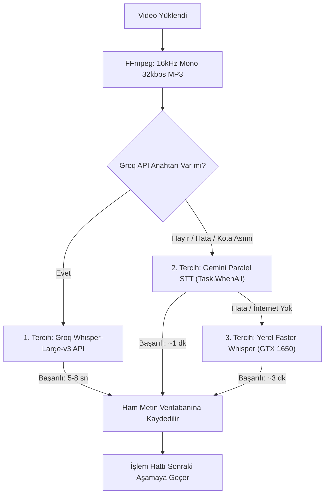

# STT Hızlandırma, Donanım Analizi ve Uçtan Uca RAG İşlem Hattı Mimari Dokümanı

**Oluşturulma Tarihi:** 6 Ekim 2026  
**Konum:** `D:\Hoca\VideoOzet\docs\stt_hizlandirma_ve_rag_islem_hatti_mimari_dokumani.md`

---

## 1. Giriş ve Amaç

Bu doküman, VideoOzet sisteminde video yüklemeden başlayıp nihai çoklu video serisi ve senaryo üretimine kadar uzanan işlem hattının mimarisini, CapCut hızında (~5-10 saniye) transkripsiyon sağlamak için yapılan donanım analizini ve transkript çıkarıldıktan sonra verinin RAG (Retrieval-Augmented Generation) tarafından nasıl işlenip halüsinasyonsuz içerik üretildiğini kayıt altına almak amacıyla hazırlanmıştır.

---

## 2. Donanım Değerlendirmesi ve Kapasite Analizi

Kullanıcı sistem bilgileri (DxDiag raporu):
- **İşlemci (CPU):** Intel(R) Core(TM) i7-9700 @ 3.00GHz (8 Fiziksel Çekirdek, AVX2 desteği)
- **Sistem Belleği (RAM):** 16 GB RAM (Kullanılabilir: ~12 GB)
- **Ekran Kartı (GPU):** NVIDIA GeForce GTX 1650 (Dedicated VRAM: **3935 MB / ~4 GB**)
- **İşletim Sistemi:** Windows 11 Pro 64-bit

### Donanım Uygunluk Raporu:
1. **İşlemci ve Bellek:** 8 çekirdekli i7-9700 ve 16 GB RAM, paralel HTTP istekleri, ses parçalama (FFmpeg), Docker servisleri (Postgres, RabbitMQ, Redis, Ollama) ve hafif yerel modeller için fazlasıyla yeterlidir.
2. **Ekran Kartı (GTX 1650 - 4 GB VRAM):**
   - Orijinal büyük model olan `whisper-large-v3` (~10 GB VRAM ister) bu karta sığmaz ve bellek aşımı (OOM) verir.
   - Ancak CTranslate2 tabanlı optimize edilmiş **`faster-whisper (whisper-large-v3-turbo int8)`** veya **`whisper-medium`** modelleri yalnızca **~2.2 GB VRAM** tüketir ve GTX 1650 üzerinde sorunsuz çalışır.
   - 45 dakikalık bir videonun GTX 1650 ile yerel işlenmesi **2 ila 4 dakika** sürer ve GPU fanlarını tam yükte çalıştırır.

---

## 3. STT Hızlandırma Seçenekleri ve Maliyet Analizi

| Seçenek | Teknoloji | Süre (45 dk Video) | Maliyet | Bilgisayara Yükü |
| :--- | :--- | :--- | :--- | :--- |
| **1. Groq Whisper API (Önerilen)** | Groq LPU altyapısı, `whisper-large-v3` | **5 - 10 Saniye** | **%100 ÜCRETSİZ** (Kredi kartı gerekmez) | **Sıfır** |
| **2. Gemini Paralel STT** | C# `Task.WhenAll`, `gemini-3.8-flash` | **1 - 1.5 Dakika** | **%100 Ücretsiz** (Mevcut kota) | **Sıfır** |
| **3. Yerel Faster-Whisper** | GTX 1650 (int8 `large-v3-turbo`) | **2 - 4 Dakika** | **%100 Ücretsiz** (Çevrimdışı) | GPU & VRAM %100 |

### Groq API Neden Ücretsiz?
Groq şirketi, geliştirdiği özel LPU (Language Processing Unit) çiplerinin hızını dünyaya kanıtlamak amacıyla `whisper-large-v3` modelini geliştiricilere ücretsiz sunmaktadır. `console.groq.com` üzerinden Google/GitHub hesabı ile saniyeler içinde ücretsiz API anahtarı alınabilir. 32kbps mono sıkıştırılmış 1 saatlik ses dosyası yaklaşık 14 MB tuttuğundan, Groq'un 25 MB'lık tek istek sınırının altında kalır ve tek seferde 5-8 saniyede çözümlenir.

---

## 4. 3 Katmanlı Sağlayıcı Mimarisi (Fallback Chain)

Sistem tek bir servise bağımlı kalmayacak şekilde `CompositeSttProvider` ile yönetilir:

---

## 5. Video Yüklendikten Sonraki Uçtan Uca Süreç (RAG Hattı)

Transkript çıkarıldıktan sonra ham metnin yapay zekanın (RAG) okuyabileceği hale gelmesi 4 ana adımdan oluşur:

### Adım 1: Hızlı STT ve Ham Metin Kaydı
- Video depolama alanından (MinIO) indirilir.
- FFmpeg ile ses ayıklanır (16kHz, mono, 32kbps).
- STT sağlayıcısı (Groq veya Gemini Paralel) ile konuşmalar deşifre edilir.
- `video_transcripts` tablosuna `HamMetin`, kelime sayısı ve süre kaydedilir.

### Adım 2: Özetleme ve Anlamsal Analiz (Map-Reduce)
- 1 saatlik video metni ortalama 8.000–10.000 kelimedir. Yapay zekanın bunu unutmadan ve detay kaybetmeden kavraması için Map-Reduce algoritması uygulanır:
  1. **Kısa Özet:** Videonun genel ana fikri.
  2. **Detaylı Bölüm Özeti:** Kronolojik anlatım akışı.
  3. **Anahtar Kavramlar:** Videoda geçen teknik/felsefi/akademik kavramlar ve tanımları.
  4. **Konu Başlıkları:** Dersin alt konu başlıkları.
- Veriler `video_summaries` tablosuna kaydedilir.

### Adım 3: Vektör İndeksleme ve RAG Hazırlığı (Ollama bge-m3)
- Transkript ve özet metinleri 500–1000 kelimelik anlamsal bloklara (Chunk) ayrılır.
- Docker üzerinde yerel çalışan **`bge-m3`** modeli kullanılarak her parçanın 1024 boyutlu anlamsal vektörü (Embedding) hesaplanır.
- Vektörler PostgreSQL'e kaydedilir.
- `egitimler.islenmi_video_sayisi` güncellenir ve video durumu **`Tamamlandi (8)`** yapılır.
- Arayüzdeki **"Çoklu Video Serisi Planla"** butonu bu aşamada aktifleşir.

### Adım 4: Akıllı Planlayıcı ve RAG Entegrasyonu
- Kullanıcı çoklu video serisi planla butonuna bastığında:
  1. RAG motoru, kurstaki tüm tamamlanmış videoların vektörlerini ve özetlerini tarar.
  2. Müfredat sentezi yapar; tekrar eden konuları eler, eksik başlıkları belirler.
  3. İzleyicinin seviyesine uygun N bölümlük seri planı çıkarır (örn: 5 bölümlük seri).
  4. Her bir bölümün arkasına, orijinal ders videolarındaki somut kavram ve alıntıları referans bağlar.

### Adım 5: Bölüm Senaryosu Üretimi ve Kalite Denetimi (QC)
- Her bölümün senaryosu yazılırken RAG, PostgreSQL'den ilgili video kısımlarını çeker ve LLM'e kaynak metin olarak verir.
- **QualityCheck (QC) Modülü:** Üretilen metni kaynak transkriptle karşılaştırır.
  - *Groundedness (Kaynak Sadakati)* ve *Hallucination Score* hesaplar.
  - Videoda anlatılmayan hiçbir uydurma bilginin senaryoya girmesine izin verilmez.

---

## 6. Uygulama Adımları

1. **Gemini STT Paralelleştirme:** `GeminiAudioSttProvider` sınıfında sıralı döngüyü `Task.WhenAll` ile 6-8 kanal paralel yaparak mevcut süreyi 1 dakikaya indirmek.
2. **Groq STT Entegrasyonu:** `GroqWhisperSttProvider` sınıfını yazarak ücretsiz Groq API ile süreyi 5-10 saniyeye düşürmek.
3. **Konfigürasyon:** `.env` ve `appsettings.json` dosyalarına `GROQ_API_KEY` desteğini eklemek.
4. **Test:** "Mukayeseli Hukuk Felsefesi" videoları üzerinde uçtan uca çalıştırıp doğrulamak.
